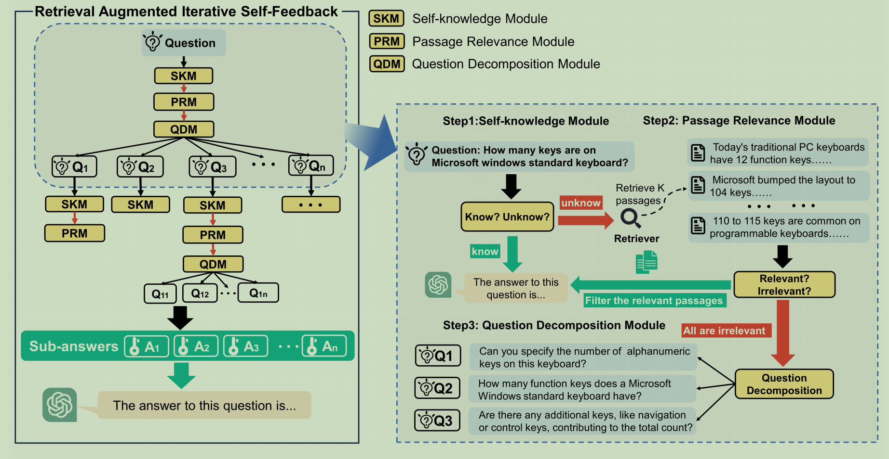
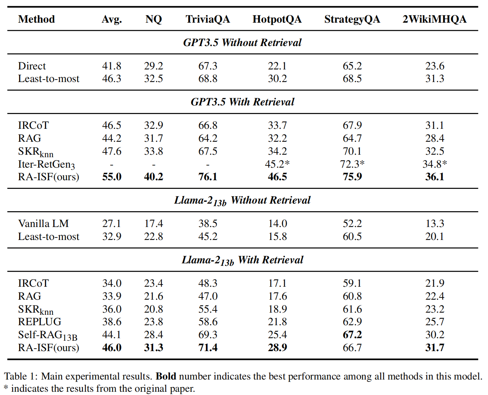
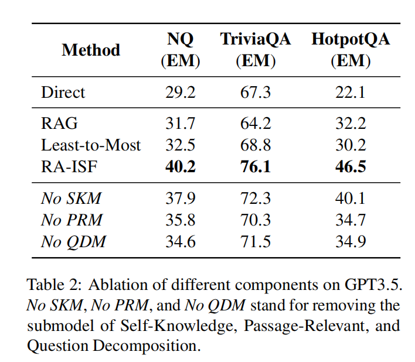
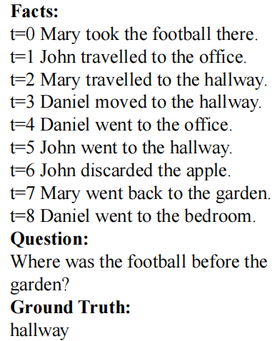
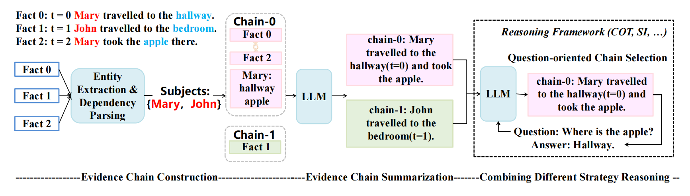
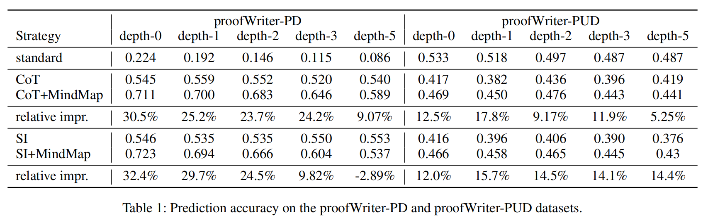
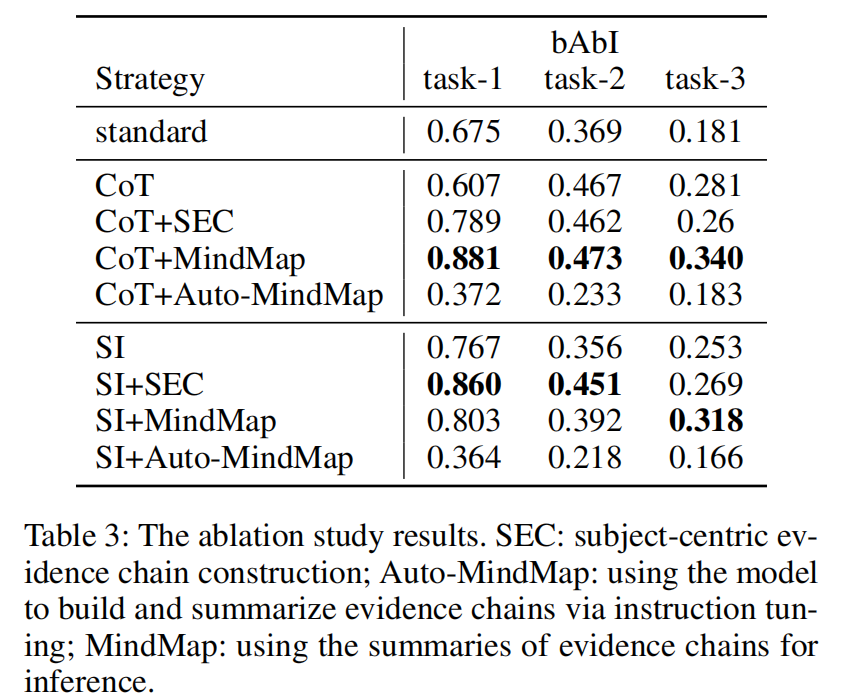

 
# RA-ISF: Learning to Answer and Understand from Retrieval Augmentation via Iterative Self-Feedback (Arxiv)

### 任务：Question(text only) ——> LLM ——> Answer(text only)

### 问题：

（1）检索结果中包含了不相关的知识削弱了模型解决问题的能力

（2）结合LLM参数化的知识和检索的知识存在困难

### 模型

* **模型结构**
  
    
    
    **Step-1:** 对于输入的问题*Q*，利用*M*know判断LLM是否可以利用internal- knowledge回答。Yes --> Step-5； No --> Step-2
    
    **Step-2:** 利用检索器*R*，获取相关的Passages
    
    **Step-3:** 利用*M*rel模块判断Passages是否和*Q*相关。Yes --> Step-5； No --> Step-4
    
    **Step-4:** 利用*M*decom将*Q*分解为多个子问题*q*1、*q*2、...、*q*n。针对每个子问题-->step-1，最后结合每个子问题及其答案-->step-5，得到问题*Q*的答案。
    
    **Step-5:** 回答问题
    
    *M*know、*M*rel、*M*decom都是可训练模块。三个模块的训练集D*根据LLM构建，具体参考论文附录。

* **训练**
  
  在训练集D*上微调条件语言模型（LLama），得到上述三个模块。

* **推理**
  
  参考上述五个步骤

### 结果：

**Main Results**

**Ablation Study**

### 思考（为什么能中？）
arxiv论文（未接收）
提出了一种策略（知识蒸馏）用来平衡LLM参数化的知识和外部检索知识设计了一个迭代的问题分解方法，先前的方法（例如，COT）LLM既负责将问题分解子问题，又负责解决子问题，最后还要提供答案。本论文提出的方法相当于将问题分解能力外包给了其他模型（通过知识蒸馏的方式），从而缓解了LLM的压力。

## 2. MindMap: Constructing Evidence Chains for Multi-Step Reasoning in Large Language Models (AAAI)

### 任务：

例如： “David picked up the apple”、“David went to
the bedroom,” -->  apple’s location being in the
bedroom

### 问题：
现有方法忽略了给定的多个事实($t=1,...,t=n$) 间内在的关联关系。

### 模型：

模型主要由三个模块组成：

**1. Evidence Chain Construction Module**: 将事实与同一subject相关的事实组织在一起（Evidence Chain）;

**2. Evidence Chain Summarization**: 为了获得更加一致、连贯的信息，该模用于生成Evidence Chain的摘要; 

**3. Evidence Chain Utilization for Inference**：与现有推理框架（CoT、SI）结合，提升现有方法的推理能力。

### 结果：

**Main Results：**

MindMap 可以作为一个即插即用的插件，对现有框架的提升很明显。其中depth指回答问题需要的推理步骤。

**Ablation Study:**

**SEC**: *w/o* Evidence Chain Summarization

**Auto-MindMap**:  build evidence
chain through instruction learning

## Verify-and-Edit: A Knowledge-Enhanced Chain-of-Thought Framework

### 问题：

### 动机：

### 模型：

### 结论：

## 2. Making Large Language Models Better Reasoners with Step-Aware Verifier

### 问题：

### 动机：

### 模型：

### 结论